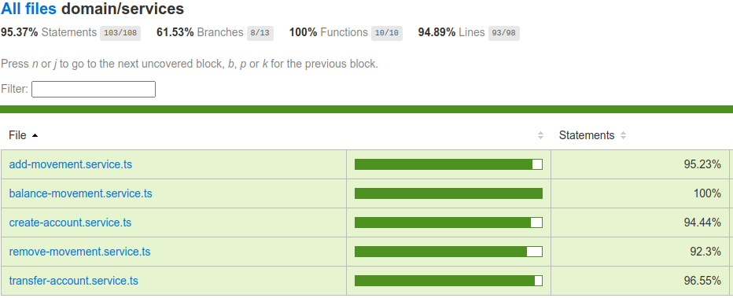

## Descrição

Uma fintech está iniciando sua operação no Brasil e pretende se posicionar como um banco digital. Após a equipe de produto realizar diversas análises chegaram a seguinte conclusão, vão iniciar a construção da plataforma pelo core bancário que deve possuir as seguintes funcionalidades:

1 - Criar conta do cliente   
2 - Creditar conta   
3 - Debitar conta   
4 - Transferir fundos entre as contas internas do banco que deve utilizar os recursos de debitar e creditar criados anteriormente   
5 - Obter saldo da conta   

## Instalação

```bash
$ npm install
$ edit .env.development
$ docker-compose up
```

## Rodar aplicação

```bash
# development
$ npm run start

# watch mode
$ npm run start:dev

# production mode
$ npm run start:prod
```

## Teste

```bash
# unit tests
$ npm run test

# e2e tests
$ npm run test:e2e

# test coverage
$ npm run test:cov
```

## Cobertura

Current test coverage



## Endpoints API
<a href="endpoints.json" download>Click to Download - INSOMNIA</a>    
<a href="desafio-fintech-backend.postman_collection.json" download>Click to Download - POSTMAN</a>

**Movement**   
POST *{{ base_url }}/movement/remove*   
POST *{{ base_url }}/movement/add*   

**Accounts**   
GET *{{ base_url }}/account/:account-id/balance*  
POST *{{ base_url }}/account*  
POST *{{ base_url }}/account/:account-id/transfer*  
## Support

Nest is an MIT-licensed open source project. It can grow thanks to the sponsors and support by the amazing backers. If you'd like to join them, please [read more here](https://docs.nestjs.com/support).


## License

Nest is [MIT licensed](LICENSE).

